# SmartBiz Task Automation 🧠⚙️

**SmartBiz Task Automation** is a Python-powered web platform that simplifies essential business operations. It offers tools for AI-based product description generation, price tracking, web scraping, invoice generation, and system task management — all accessible via a clean  dashboard.

---

## 🚀 Features

-  AI-Powered Product Description Generator (LLM Integrated)
-  E-commerce Price Alert Notifier
-  Smart Web Scraper (Playwright/Selenium)
-  Professional Invoice Generator
-  OS-Level Task Controller (open browser, system info, etc.)
-  Secure User Authentication
-  Admin Dashboard with Role Management (User/Admin)
-  SQLite/MySQL database integration

---

## 🛠️ Tech Stack

| Layer       | Technology                     

| Backend     | Python, Flask, Flask-Login      
| Frontend    | HTML5, CSS3, Bootstrap, Jinja2  
| Database    | MySQL, SQLAlchemy ORM  
| Forms       | Flask-WTF             
| Scraping    | Playwright           
| AI Engine   | TinyLLaMA 


---

## 🖥️ Project Structure


SmartBiz/
├── app/
│ ├── templates/
│ ├── static/
│ ├── routes.py
│ ├── forms/
│ ├── services/
│ └── init.py
├── models/
├── database/
├── README.md
├── requirements.txt
└── run.py


---

## 🔧 Installation & Setup

Download and setup python 3.x , mysql , tinyllama(ollama)  , playwright

### 1. Clone the repository

```bash
git clone https://github.com/yourusername/smartbiz-task-automation.git
cd smartbiz-task-automation

## 2.

python -m venv venv
venv\Scripts\activate  # Windows

#3. Install dependencies

pip install -r requirements.txt


#4 setup the database 
flask db init
flask db migrate -m "Initial"
flask db upgrade


#5 run the app
python run.py


🙋‍♂️ Author
Shahan Ahmad
GitHub: @shahanconnect


Screenshots-

## 📸 Screenshots

### 🔹 Homepage
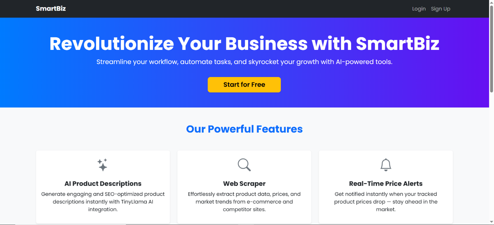
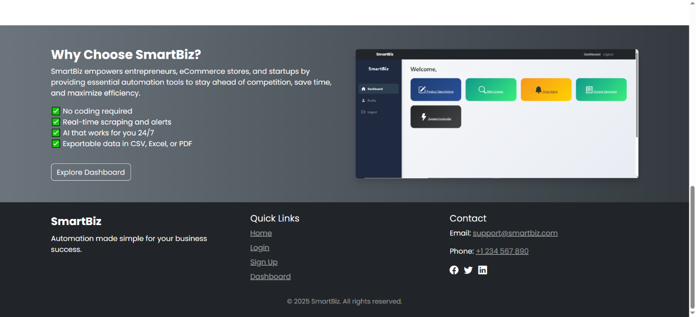

### 🔹 Signup & Login
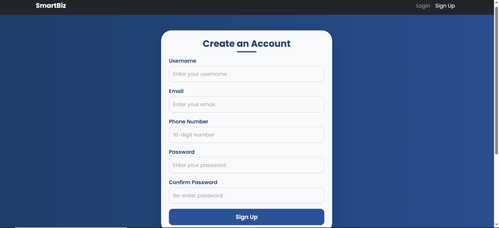
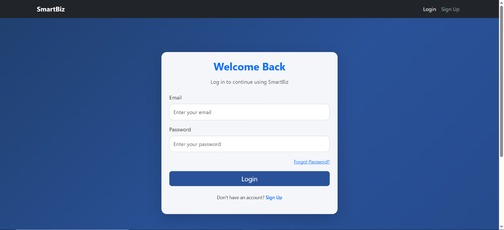

### 🔹 User Dashboard


### 🔹 Admin Dashboard
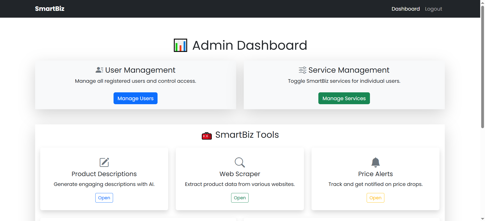

### 🔹 User Profile
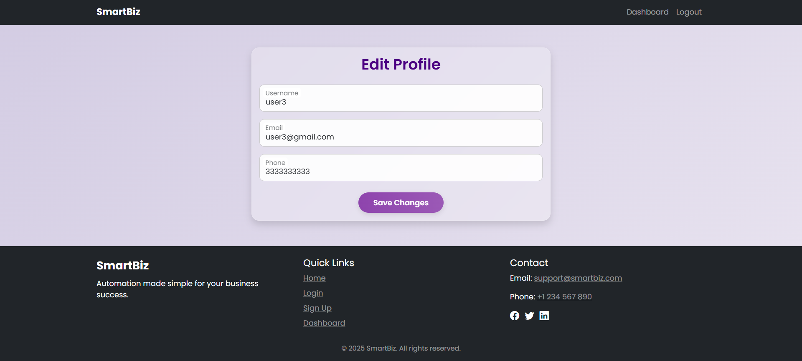

### 🔹 Product Description Generator
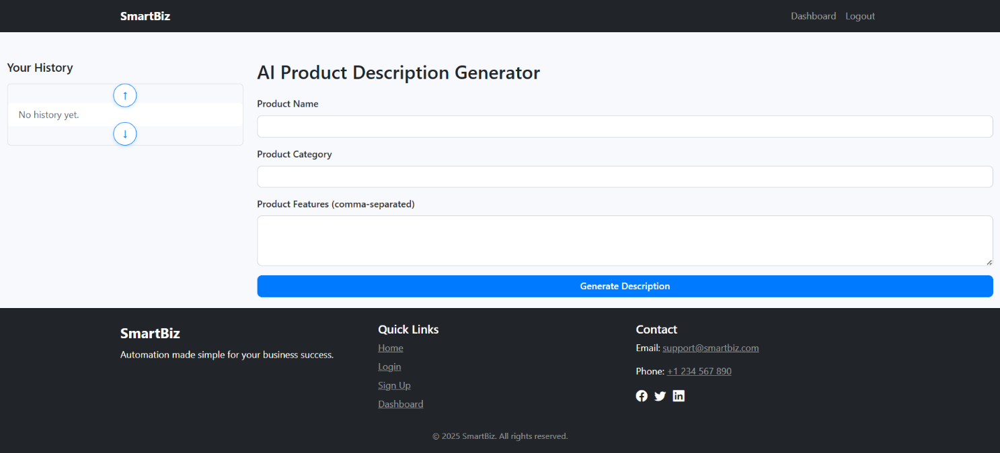

### 🔹 Invoice Generator
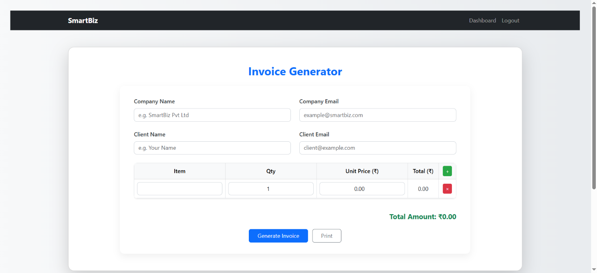
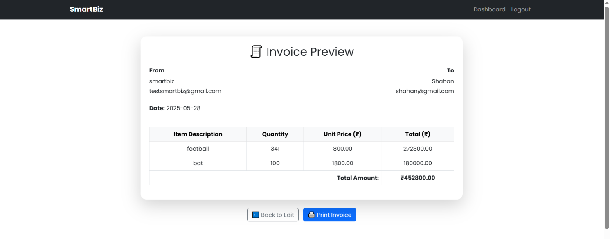

### 🔹 E-commerce Scraper
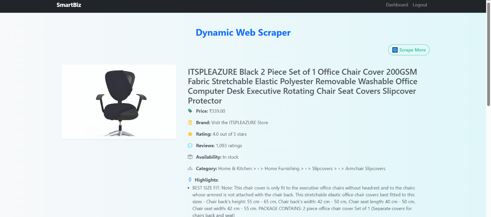
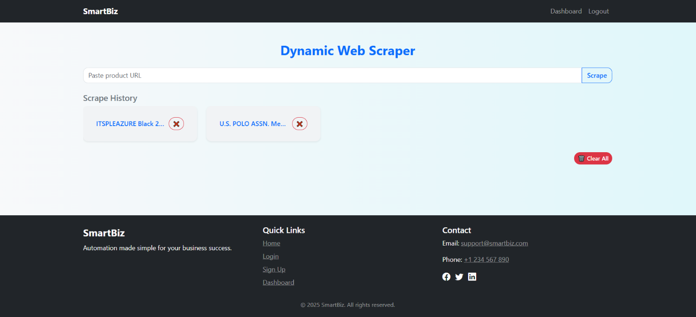

### 🔹 Price Alert Notifier
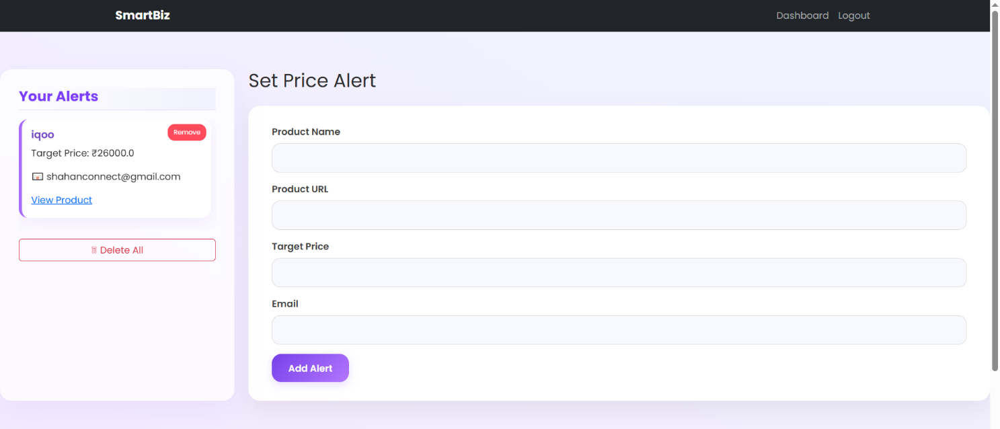

### 🔹 Service Management
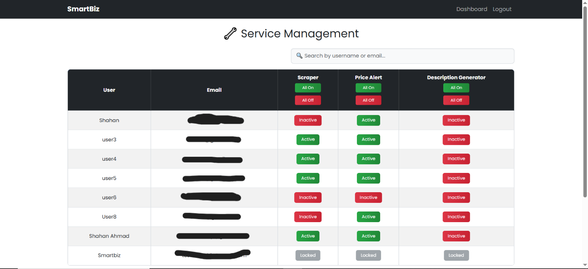

### 🔹 System Controller
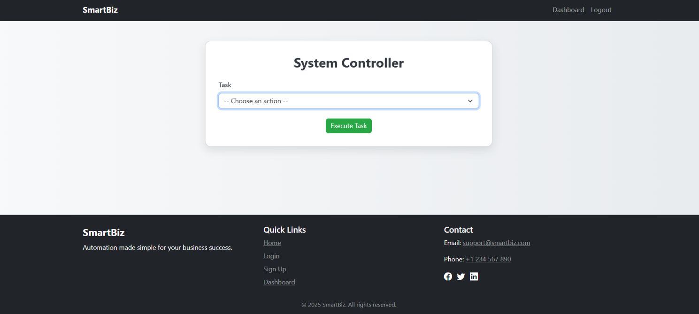

### 🔹 User Management
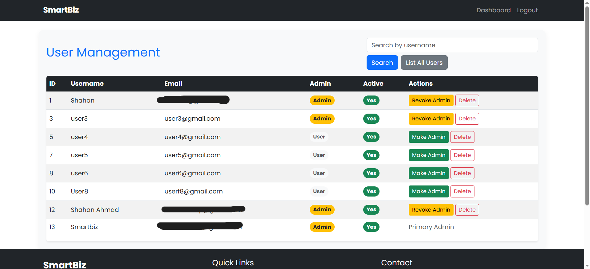
